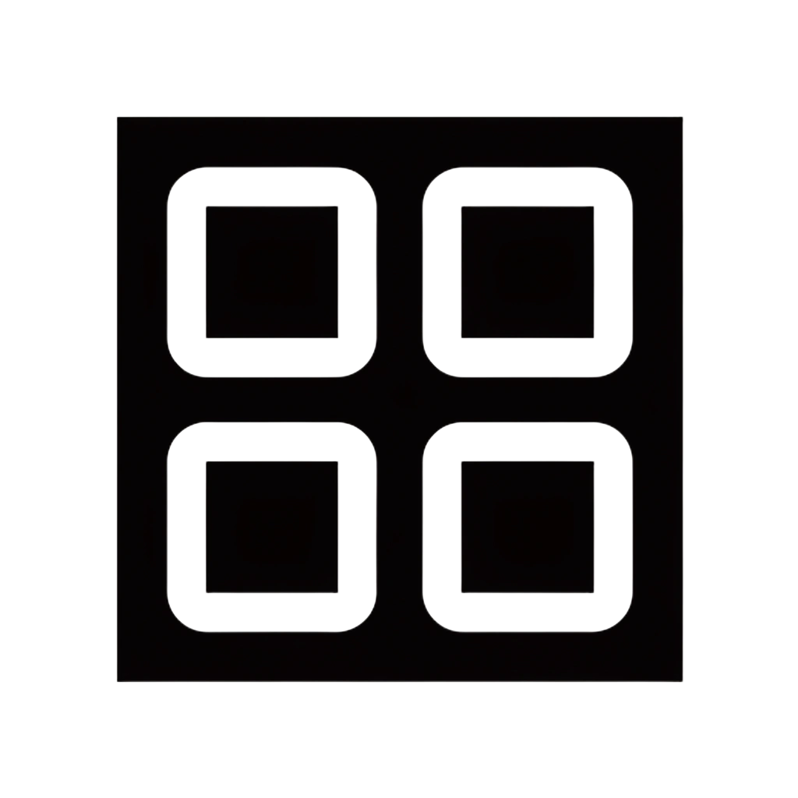

<!-- LANGUAGE SELECTION -->
<div align="center">
  <strong>
    <a href="../README.md">English</a> | <a href="README_zh.md">中文</a>
  </strong>
</div>

<!-- PROJECT LOGO -->
<br />
<div align="center">
    

  <h3 align="center">AUTO-MAC-LAYOUT</h3>

  <p align="center">
    根据当前显示器设置自动保存和恢复 Finder 桌面图标位置
  </p>
</div>


<!-- TABLE OF CONTENTS -->
<details>
  <summary>目录</summary>
  <ol>
    <li>
      <a href="#关于项目">关于项目</a>
      <ul>
        <li><a href="#功能特性">功能特性</a></li>
      </ul>
    </li>
    <li>
      <a href="#快速开始">快速开始</a>
      <ul>
        <li><a href="#系统要求">系统要求</a></li>
        <li><a href="#安装方式">安装方式</a></li>
        <li><a href="#权限配置">权限配置</a></li>
      </ul>
    </li>
    <li><a href="#使用说明">使用说明</a></li>
    <li><a href="#开发">开发</a></li>
    <li><a href="#故障排查">故障排查</a></li>
    <li><a href="#参与贡献">参与贡献</a></li>
  </ol>
</details>


<!-- ABOUT THE PROJECT -->
## 关于项目

Auto Mac Layout 是一个轻量级的 macOS 菜单栏工具，可以根据当前的显示器拓扑自动保存和恢复 Finder 桌面图标位置。

当你插拔显示器、切换镜像或改变排列时，Finder 往往会打乱桌面图标。本工具通过为活跃显示器组合生成指纹，并应用相应保存的布局来解决这个问题。

### 功能特性

- 菜单栏应用，Dock 中不显示图标
- 按显示器布局分别存储配置
- 显示器配置改变时自动应用（带防抖延迟）
- 从菜单手动触发"保存当前布局"
- 桌面文件集改变时自动保存
- 支持"登录时启动"选项
- 采用原子写入方式降低配置文件损坏风险

<p align="right">(<a href="#readme-top">返回顶部</a>)</p>

<!-- GETTING STARTED -->
## 快速开始

### 系统要求

- macOS（需要 AppleScript/Finder 自动化功能）
- Rust 工具链（仅在从源码编译时需要）

### 安装方式

#### 方式一：从源码编译

```bash
cargo build --release
```

可执行文件位置：

```text
target/release/auto-mac-layout
```

运行：

```bash
./target/release/auto-mac-layout
```

#### 方式二：添加到登录启动项

首次运行后，从菜单中启用"登录时启动"选项。

### 权限配置

该应用通过 AppleScript 控制 Finder 桌面图标位置。首次使用时，macOS 可能会要求权限。

请允许以下权限：

- 自动化 (Automation) 中对 Finder 的控制权限
- 根据你的系统配置，可能还需要辅助功能 (Accessibility) 权限

如果布局获取/应用失败，请检查：

- `系统设置 -> 隐私与安全性 -> 自动化`
- `系统设置 -> 隐私与安全性 -> 辅助功能`

<p align="right">(<a href="#readme-top">返回顶部</a>)</p>


<!-- USAGE EXAMPLES -->
## 使用说明

### 菜单项说明

- `Save Current Layout`（保存当前布局）：保存当前显示器组合的桌面图标位置
- `Open Config File`（打开配置文件）：打开布局存储 JSON 文件
- `Switch Apply Delay`（切换应用延迟）：调整防抖延迟（`0ms`、`300ms`、`1000ms`、`2000ms`、`3000ms`）
- `Launch at Login`（登录时启动）：启用/禁用开机自启动
- `Quit`（退出）：退出应用

### 存储位置

布局配置存储在：

```text
~/Library/Application Support/auto-mac-layout/layouts.json
```

该文件映射每个显示器指纹到相应的桌面图标坐标列表。

<p align="right">(<a href="#readme-top">返回顶部</a>)</p>


<!-- DEVELOPMENT -->
## 开发

格式检查：

```bash
cargo fmt --check
```

编译检查：

```bash
cargo check
```

发布构建：

```bash
cargo build --release
```

<p align="right">(<a href="#readme-top">返回顶部</a>)</p>


<!-- TROUBLESHOOTING -->
## 故障排查

**显示器改变后图标没有恢复：**
- 确认 Finder 桌面图标显示已启用
- 在该显示器组合下重新执行一次"保存当前布局"
- 验证自动化/辅助功能权限设置

**配置文件为空：**
- 保存时桌面至少需要有一个项目存在

**应用运行但菜单栏图标缺失：**
- 检查启动日志中是否有图标加载失败信息

<p align="right">(<a href="#readme-top">返回顶部</a>)</p>


<!-- CONTRIBUTING -->
## 参与贡献

欢迎提交 Issue 和 Pull Request。

建议流程：

1. Fork 仓库并创建功能分支
2. 运行 `cargo fmt --check` 和 `cargo check`
3. 在 Pull Request 中说明变更行为和复现步骤

<p align="right">(<a href="#readme-top">返回顶部</a>)</p>
